<div align="center">
  <h1>🧠 Algorythmos AI Research Scheduler</h1>

  <p><strong>Top AI Research → X & LinkedIn Automation</strong></p>

  <p><i>arXiv → GPT-4o-mini → Notion → GitHub Actions → X + LinkedIn</i></p>

</div>

<p align="center">

  

  

  

  

  

  

  

</p>

---

## Overview

This repo **automatically discovers, summarizes, and shares** cutting-edge AI research papers from **arXiv** to **X (Twitter) and LinkedIn** — fully managed via **Notion** and **GitHub Actions**.

**Focus:** State-of-the-art (SOTA) innovations in cs.AI, cs.LG, cs.CL, cs.CV

- **<24h papers** get +20 points
- **Innovation keywords** (SOTA, novel, breakthrough) +5pts each  
- **Duplicate prevention** via arXiv ID matching
- **Research-focused summaries** highlighting key contributions
- **Full observability** in Notion + Actions logs

**Built and maintained by:** Algorythmos

---

## Architecture

```mermaid
graph TD
    A[arXiv API] --> B[fetch_ai_news.py]
    B -->|Score papers by novelty/recency| C[GPT-4o-mini Summarization]
    C -->|Research-focused summaries| D[Notion DB]
    D -->|Status=Scheduled| E[Workflow Chaining]
    E -->|X API| F[Tweet Published 🚀]
    E -->|LinkedIn API| G[Post Published 🚀]
    F & G --> H[Update Notion with URLs]
```



---

## Features

* 📚 **Research paper sources** (arXiv cs.AI, cs.LG, cs.CL, cs.CV)
* 🏆 **SOTA-focused scoring** (novelty keywords, recency, innovation indicators)
* 🧠 **Smart summarization** with `gpt-4o-mini` — highlights innovations, methods, results
* 🗂️ **Notion as research queue** (includes arXiv ID, authors, categories)
* ⏰ **DST-aware scheduling**: Runs daily at ~10:05 AM Paris time
* 🔁 **Event-chained workflows**: Poster auto-triggers after fetch
* 🛡️ **Duplicate prevention**: arXiv ID tracking + title similarity
* 🎯 **Platform-optimized**: Short for X (≤280 chars), detailed for LinkedIn (≤2000 chars)
* 🔗 **URL tracking**: Stores arXiv link, X URL, LinkedIn URL in Notion
* 💰 **Compute-optimized**: ~45 minutes/month (2% of GitHub free tier)


---

```mermaid```mermaid

## Quick Start

graph LRgraph TD

### 1. Setup GitHub Secrets

    A[10:05 AM] --> B[fetch_ai_news.py]    A[AI RSS Feeds] --> B[fetch_ai_news.py]

Navigate to **GitHub → Settings → Secrets → Actions** and add:

    B --> C[Score & Summarize]    B -->|Summarize with gpt-4o-mini| C[Notion DB]

#### Required Secrets:

    C --> D[Write to Notion: Scheduled]    C -->|Status=Scheduled & Time ready| D[X Poster]

| Secret | Description |

|--------|-------------|    D --> E[10:10 AM: main.py]    D -->|X API| E[Tweet Published 🚀]

| `NOTION_TOKEN` | Your Notion integration token ([create here](https://www.notion.so/my-integrations)) |

| `NOTION_DB_ID` | Target database ID (from database URL) |    E --> F[Post to X]```

| `X_API_KEY` | X/Twitter API key (from [Developer Portal](https://developer.x.com/)) |

| `X_API_SECRET` | X/Twitter API secret |    E --> G[Post to LinkedIn]

| `X_ACCESS_TOKEN` | X/Twitter OAuth access token |

| `X_ACCESS_TOKEN_SECRET` | X/Twitter OAuth access token secret |    F & G --> H[Update Notion: Posted + URLs]---

| `LINKEDIN_ACCESS_TOKEN` | LinkedIn OAuth access token (user or organization) |

| `LINKEDIN_CLIENT_ID` | LinkedIn app client ID |```

| `LINKEDIN_CLIENT_SECRET` | LinkedIn app client secret |

| `GH_PAT` | GitHub Personal Access Token with `workflow` scope (see setup below) |## Features


#### Optional Secrets:---


| Secret | Description | Default |* 📰 **Multi-source AI feeds** (OpenAI, Google AI, DeepMind, NVIDIA, AWS ML, TechCrunch, VentureBeat)

|--------|-------------|---------|

| `OPENAI_API_KEY` | OpenAI API key for summarization | Heuristic fallback if missing |## Setup (GitHub Secrets)* 🧠 **Smart summarization** with `gpt-4o-mini` (cost-effective, high-quality) — graceful fallback to heuristics

| `OPENAI_MODEL` | Override OpenAI model | `gpt-4o-mini` |

* 🗂️ **Notion as content queue** (`Status=Scheduled` + `Scheduled Time` properties)

#### Setting up `GH_PAT` (Required for Workflow Chaining):

| Secret | Description |* ⏰ **DST-aware scheduling**: Runs once daily at ~10:05 AM Paris time year-round (dual UTC crons)

The `GH_PAT` secret enables automatic workflow triggering. Without it, the Social Publisher won't auto-start after content aggregation.

|--------|-------------|* 🔁 **Event-chained workflows**: Poster auto-triggers after successful fetch for instant publishing

1. Go to https://github.com/settings/tokens/new

2. Set "Note": `Algorythmos Content Scheduler - Workflow Trigger`| `NOTION_TOKEN` | Notion Internal Integration Token |* 🛡️ **Pre-check validation**: Skips poster run if no ready posts exist (saves compute minutes)

3. Select expiration: **90 days** (or longer)

4. Under "Select scopes", check **only** `workflow`| `NOTION_DB_ID` | Database ID for posts |* 🧪 **Dry-run mode**: Test with `--dry-run` flag or workflow dispatch for JSON output

5. Click **"Generate token"** and copy it

6. Add to repository:| `X_API_KEY`, `X_API_SECRET`, `X_ACCESS_TOKEN`, `X_ACCESS_TOKEN_SECRET` | X Developer App |* 🎯 **Relevance scoring**: Keyword matching + recency decay (48h window)

   - Go to **Settings → Secrets and variables → Actions**

   - Click **"New repository secret"**| `LINKEDIN_ACCESS_TOKEN` | LinkedIn API (User-to-Organization) |* 💰 **Compute-optimized**: ~45 minutes/month usage (2% of GitHub free tier)

   - Name: `GH_PAT`

   - Value: `ghp_your_token_here` (paste the token)| `OPENAI_API_KEY` | OpenAI API Key |

   - Click **"Add secret"**

---

> ⚠️ **Important:** The default `GITHUB_TOKEN` cannot trigger workflows due to GitHub's security restrictions. You **must** use a PAT with `workflow` scope.

---

---

## Quick Start

### 2. Test Locally (Dry Run)

## Run Locally

```bash

# Install dependencies### 1. Setup Secrets

pip install -r requirements.txt

```bash

# Create .env file with your secrets

cp .env.example .envpip install -r requirements.txtNavigate to **GitHub → Settings → Secrets → Actions** and add:

# Edit .env with your actual credentials

python fetch_ai_news.py --dry-run

# Test fetcher (no writes to Notion)

python fetch_ai_news.py --dry-run```**Required:**


# Test poster (no actual posting)* `NOTION_TOKEN` - Your Notion integration token

python main.py --dry-run

```---* `NOTION_DB_ID` - Target database ID


Expected output: JSON with top article details or "No fresh items (≤48h); Skipped."* `ACCESS_TOKEN`, `ACCESS_TOKEN_SECRET` - X/Twitter OAuth tokens


---## Features* `API_KEY`, `API_KEY_SECRET` - X/Twitter API credentials


### 3. Run in Production


**Option A: Manual trigger*** 📰 **Multi-source AI feeds** (OpenAI, Google AI, DeepMind, NVIDIA, AWS ML, TechCrunch, VentureBeat)**Optional:**


1. Go to **Actions → 📰 Algorythmos Content Aggregator → Run workflow*** 🧠 **Smart summarization** with `gpt-4o-mini` (cost-effective, high-quality) — graceful fallback to heuristics* `OPENAI_API_KEY` - Enables AI summarization (without it, uses heuristic fallback)

2. Set `dry_run=false`

3. Click **Run workflow*** 🗂️ **Notion as content queue** (`Status=Scheduled` + `Scheduled Time` properties)* `OPENAI_MODEL` - Override model (default: `gpt-4o-mini`)

4. Watch as it automatically triggers the Social Publisher after completion!

* 🎯 **Relevance scoring**: Keyword matching + recency decay (48h window, <6h gets +15 points)

**Option B: Automatic schedule**

* 🔄 **Dual platform posting**: Automatically posts to both X (Twitter) and LinkedIn### 2. Test Locally (Dry Run)

- Fetcher runs daily at **~10:05 AM Europe/Paris time** (DST-aware)

- Poster triggers automatically **30 seconds after** fetch completes successfully* 🔗 **URL tracking**: Stores tweet_url and linkedin_url back in Notion after posting

- Also runs independently at **~10:10 AM** as a backup schedule

* 🛡️ **Duplicate prevention**: 7-day Notion history check```bash

---

* 💰 **Compute-optimized**: ~60 minutes/month usage (3% of GitHub free tier)python fetch_ai_news.py --dry-run

### 4. Monitor Execution

```

* **Fetcher**: Creates 1 `Status=Scheduled` row in Notion per run (if news found)

* **Poster**: Publishes scheduled posts and updates `X URL` and `LinkedIn URL` in Notion---

* Check **Actions** tab for detailed workflow logs with emojis 🚀

Expected output: JSON with top article details or "No fresh items (≤48h); Skipped."

---

## Scheduling

## How It Works

### 3. Run in Production

### Scheduling (DST-Aware & Compute-Optimized)

Both workflows use **dual UTC cron schedules** to maintain consistent Paris local time:

Both workflows use **dual UTC cron schedules** to maintain consistent Paris local time:

**Option A: Manual trigger**

**📰 Content Aggregator:**

* **Mar–Oct (CEST, UTC+2)**: `5 8 * 3-10 *` → 08:05 UTC = 10:05 Paris**Fetcher Schedule:*** Go to **Actions → AI Content Fetcher → Run workflow**

* **Nov–Feb (CET, UTC+1)**: `5 9 * 11,12,1,2 *` → 09:05 UTC = 10:05 Paris

* **Mar–Oct (CEST, UTC+2)**: `5 8 * 3-10 *` → 08:05 UTC = 10:05 Paris* Set `dry_run=false`

**🚀 Social Publisher:**

* **Mar–Oct (CEST, UTC+2)**: `10 8 * 3-10 *` → 08:10 UTC = 10:10 Paris* **Nov–Feb (CET, UTC+1)**: `5 9 * 11,12,1,2 *` → 09:05 UTC = 10:05 Paris* Click **Run**

* **Nov–Feb (CET, UTC+1)**: `10 9 * 11,12,1,2 *` → 09:10 UTC = 10:10 Paris

* **Plus:** Auto-triggers 30 seconds after Content Aggregator completes successfully


The 5-minute gap + instant trigger ensures Notion writes complete before posting with zero delay.**Poster Schedule:****Option B: Automatic schedule**


---* **Mar–Oct (CEST, UTC+2)**: `10 8 * 3-10 *` → 08:10 UTC = 10:10 Paris* Fetcher runs daily at ~10:05 AM Europe/Paris time


### Workflow Chaining (Automatic Publishing)* **Nov–Feb (CET, UTC+1)**: `10 9 * 11,12,1,2 *` → 09:10 UTC = 10:10 Paris* Poster runs at ~10:10 AM (5 min buffer) or immediately after fetch completes


1. **Content Aggregator** completes successfully (not dry-run)

2. Waits **30 seconds** for Notion API to sync

3. Triggers **Social Publisher** via GitHub API using `GH_PAT`The 5-minute gap ensures Notion writes complete before posting.### 4. Monitor Execution

4. Social Publisher posts immediately (no waiting for schedule)


```yaml

# .github/workflows/fetch.yml---* **Fetcher**: Creates 1 `Status=Scheduled` row in Notion per run (if news found)

trigger-publisher:

  needs: [fetch]* **Poster**: Publishes scheduled posts and updates their status

  if: ${{ success() && !inputs.dry_run }}

  steps:## Algorythmos Integration* Check **Actions** tab for workflow logs and status

    - name: Wait for Notion to sync

      run: sleep 30

    - name: Trigger publishing workflow

      env:- Plug into **Document Intelligence** for image tweets---

        GH_PAT: ${{ secrets.GH_PAT }}

      run: |- Monitor engagement via **MLOps-Algorythmos**

        curl -X POST \

          -H "Authorization: Bearer $GH_PAT" \- Scale to 100+ accounts with org-level secrets## How It Works

          https://api.github.com/repos/.../actions/workflows/post.yml/dispatches

```


------### Scheduling (DST-Aware & Compute-Optimized)


### Scoring Algorithm (Research Papers)

Each paper gets scored (0-50+ points):

```python
# Recency (time-sensitive for research)
if age < 24h: score += 20  # Brand new
elif age < 48h: score += 15
elif age < 96h: score += 10
elif age < 168h: score += 5

# Innovation keywords (SOTA indicators)
for keyword in ["state-of-the-art", "SOTA", "novel", "breakthrough"]:
    if keyword in title/abstract: score += 5

# General AI keywords  
for keyword in ["LLM", "transformer", "diffusion", "RL"]:
    if keyword in title/abstract: score += 2

# Category boost
if primary_category in ["cs.AI", "cs.LG"]: score += 3

# arXiv ID duplicate check
if arxiv_id in recent_posts: score -= 100
```

**Example scores:**
- "Novel SOTA LLM for Reasoning" (12h old) → 20 (recency) + 10 (SOTA+novel) + 6 (LLM) + 3 (cs.AI) = **39 points**
- "Improved Transformer Architecture" (2 days old) → 15 + 2 (improved) + 2 (transformer) = **19 points**


---├── requirements.txt          # Python dependencies* **Mar–Oct (CEST, UTC+2)**: `10 8 * 3-10 *` → 08:10 UTC = 10:10 Paris


## Notion Database Schema├── .github/workflows/* **Nov–Feb (CET, UTC+1)**: `10 9 * 11,12,1,2 *` → 09:10 UTC = 10:10 Paris


Your Notion database must have these properties:│   ├── fetch.yml            # Daily at 10:05 Paris (DST-aware)


| Property Name | Type | Description |│   └── post.yml             # Daily at 10:10 Paris (X + LinkedIn)The 5-minute gap ensures Notion writes complete before posting. GitHub Actions only supports UTC cron, so this dual-schedule approach automatically handles daylight saving transitions.

|---------------|------|-------------|

| `Title` | Title | Article title (auto-populated) |└── README.md                # This file

| `Status` | Select | `Scheduled` → `Posted` → `Error` |

| `Scheduled Time` | Date | When to post (ISO 8601 format) |```### Workflow Chain

| `X URL` | URL | Posted tweet URL (updated after posting) |

| `LinkedIn URL` | URL | Posted LinkedIn URL (updated after posting) |

| `Source URL` | URL | Original article link |

| `Media URL` | URL | Optional image URL |---```

| `Error Log` | Text | Error messages if posting fails |

Daily at 10:05 Paris

**Create the database:**

1. Duplicate [this template](https://algorythmos.notion.site/AI-Content-Queue-Template-123456) (or create manually)## Costs (typical)       ↓

2. Add your Notion integration to the database (Share → Add connection)

3. Copy database ID from URL: `notion.so/workspace/{DB_ID}?v=...`[AI Content Fetcher]


---| Service              | Monthly | Notes                          |       ↓ (writes to Notion)


## Local Development|----------------------|---------|--------------------------------|       ↓ (5-min buffer)


### Environment Setup| GitHub Actions       | **Free** | ~60 min/month (3% of free tier) |[X Poster at 10:10] ← also triggers immediately on fetch success


```bash| OpenAI `gpt-4o-mini` |  <$0.01 | ~1 short summary/day           |       ↓

# Create virtual environment

python -m venv .venv| Notion API           |    Free | Included in plan               |[check_ready_to_post.py validates Notion]

source .venv/bin/activate  # On Windows: .venv\Scripts\activate

| **Total**            | **<$0.01** | Virtually free to run       |       ↓ (if posts ready)

# Install dependencies

pip install -r requirements.txt[main.py publishes to X]


# Create .env file---```

cat > .env << EOF

NOTION_TOKEN=ntn_your_token_here

NOTION_DB_ID=your_database_id

X_API_KEY=your_x_api_key## Testing**Compute Efficiency:** Both workflows run once daily = ~2 runs/day = ~60 min/month (3% of free tier)

X_API_SECRET=your_x_api_secret

X_ACCESS_TOKEN=your_x_access_token

X_ACCESS_TOKEN_SECRET=your_x_access_token_secret

LINKEDIN_ACCESS_TOKEN=your_linkedin_access_token* **LLM disabled:** Remove `OPENAI_API_KEY` → heuristic summaries activate automatically### Files

LINKEDIN_CLIENT_ID=your_linkedin_client_id

LINKEDIN_CLIENT_SECRET=your_linkedin_client_secret* **Model override:** Set `OPENAI_MODEL` secret to test different models

OPENAI_API_KEY=sk-your_openai_key  # Optional

EOF* **No news scenario:** Fetcher writes a "Skipped" row to Notion* **`fetch_ai_news.py`** (445 lines) - RSS parser, scorer, OpenAI integration, Notion writer


# Test components* **Manual dispatch:** Test anytime via Actions tab with `dry_run` toggle* **`main.py`** - X/Twitter poster with thread support

python fetch_ai_news.py --dry-run  # Fetcher

python main.py --dry-run           # Poster* **Dry run mode:** `python fetch_ai_news.py --dry-run` for JSON output* **`check_ready_to_post.py`** - Pre-check validation script

```

* **`.github/workflows/fetch.yml`** - Fetcher workflow (daily at 10:05 Paris, DST-aware)

---

---* **`.github/workflows/post.yml`** - Poster workflow (daily at 10:10 Paris + event-chained)

## Troubleshooting


### Workflow Trigger Fails (403 Error)

## Contributing---

**Symptom:** Content Aggregator completes but Social Publisher doesn't start. Logs show:

```

❌ Failed to trigger workflow. Status code: 403

Resource not accessible by integrationPRs and issues welcome. If this helped, please ⭐ the repo.## Costs (typical)

```


**Solution:** You need to add the `GH_PAT` secret (see [Setup section](#setting-up-gh_pat-required-for-workflow-chaining)).

---| Service              | Monthly | Notes                          |

---

| -------------------- | ------: | ------------------------------ |

### No Content Found

## License| GitHub Actions       | **Free** | ~60 min/month (3% of free tier) |

**Symptom:** Fetcher logs "No fresh items (≤48h); Skipped."

| OpenAI `gpt-4o-mini` |  <$0.01 | ~1 short summary/day           |

**Possible causes:**

1. All recent articles already posted (check Notion for duplicates in last 7 days)MIT| Notion API           |    Free | Included in plan               |

2. RSS feeds down or returning stale content

3. Scoring threshold too high (all articles scored <5)| **Total**            | **<$0.01** | Virtually free to run       |


**Solution:** Check Actions logs for feed parsing errors, or manually trigger with dry-run to inspect scores.---


---**Compute optimization:** Running once daily instead of hourly saves ~1,035 minutes/month (95% reduction)!


### LinkedIn Posting Fails**France Remote Worldwide** | [algorythmos.fr](https://algorythmos.fr) | [@algorythmos](https://x.com/algorythmos)


**Symptom:** X post succeeds but LinkedIn fails with 401/403 errors.---


**Possible causes:**## Testing Matrix

1. LinkedIn access token expired (60-day validity)

2. Missing `w_member_social` scope* **LLM disabled:** Remove `OPENAI_API_KEY` → heuristic summaries activate automatically

3. Organization ID required but not set* **Model override:** Set `OPENAI_MODEL` secret to test different models (e.g., `gpt-4`, `gpt-3.5-turbo`)

* **No news scenario:** Fetcher writes a "Skipped" row to Notion (production) or prints message (dry-run)

**Solution:** * **Manual dispatch:** Test anytime via Actions tab with `dry_run` toggle

- Regenerate LinkedIn token using `get_linkedin_token.py`* **Event-chain validation:** After manual fetch, verify poster auto-triggers within seconds

- Ensure scope includes `w_member_social`

- If posting to org, set `LINKEDIN_ORG_ID` secret---


---## Project Structure


## Cost Analysis```

notion-x-scheduler/

**GitHub Actions (Free Tier: 2,000 min/month):**├── fetch_ai_news.py          # AI news fetcher (RSS → scoring → summarize → Notion)

- Content Aggregator: ~2 min/run × 30 runs = 60 min/month├── main.py                   # X/Twitter poster (Notion → X API)

- Social Publisher: ~1 min/run × 30 runs = 30 min/month├── check_ready_to_post.py    # Pre-check validation for poster

- **Total:** ~90 min/month (**4.5% of free tier**)├── requirements.txt          # Python dependencies

├── .github/workflows/

**OpenAI API (gpt-4o-mini):**│   ├── fetch.yml            # Daily at 10:05 Paris (DST-aware)

- Input: ~500 tokens/summary × 30 summaries = 15K tokens/month│   └── post.yml             # Daily at 10:10 Paris + event-chained

- Output: ~150 tokens/summary × 30 summaries = 4.5K tokens/month└── README.md                # This file

- **Total cost:** ~$0.003/month (practically free)```


**X API:** Free tier (1,500 posts/month, we use ~30)---


**LinkedIn API:** Free tier (100 posts/day, we use ~1)## Contributing


**Notion API:** Free tier (unlimited for integrations)PRs and issues welcome. If this helped, please ⭐ the repo:

**[https://github.com/skalaliya/notion-x-scheduler](https://github.com/skalaliya/notion-x-scheduler)**

---

---

## Algorythmos Integration

## License

- Plug into **Document Intelligence** for image tweets

- Monitor engagement via **MLOps-Algorythmos**MIT

- Scale to 100+ accounts with org-level secrets

---

## Contributing

Built and maintained by the Algorythmos team. For questions or contributions, open an issue or PR!

---

## License

MIT License - See [LICENSE](LICENSE) for details.
